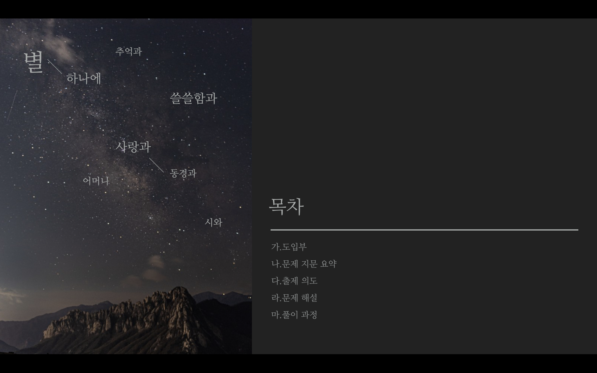
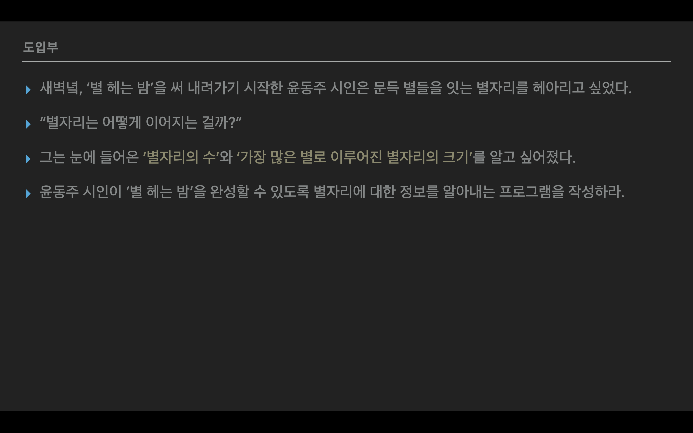
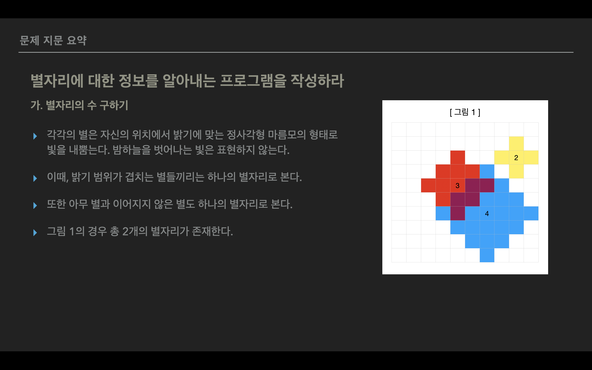
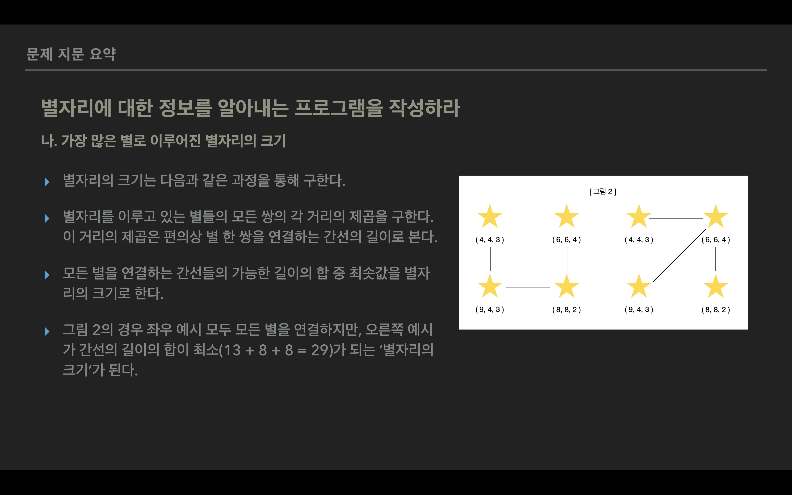
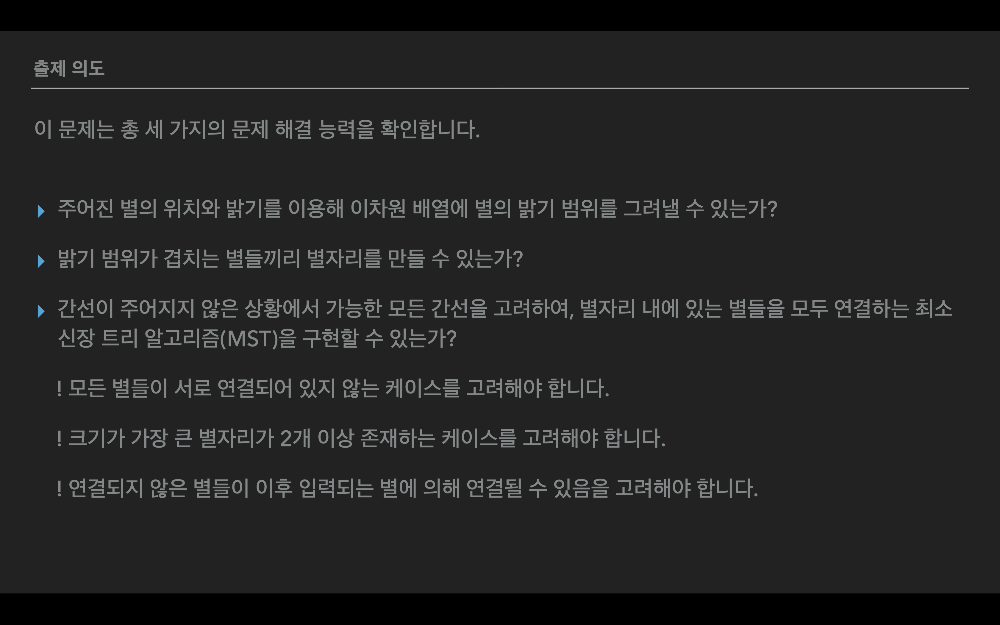
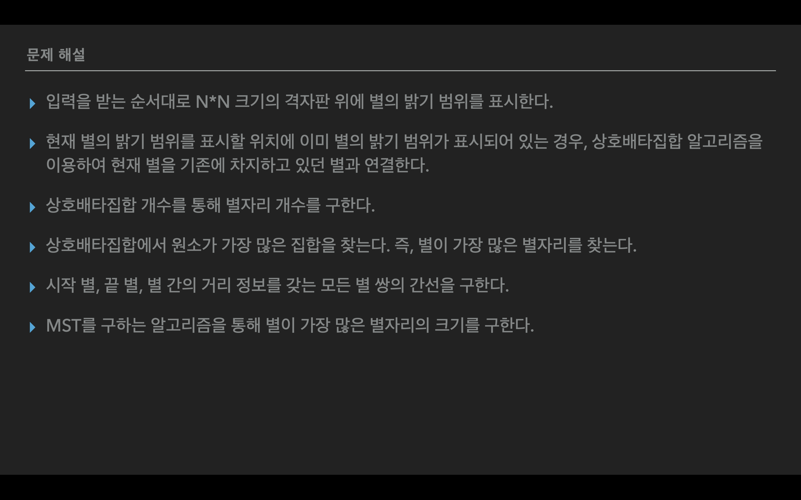
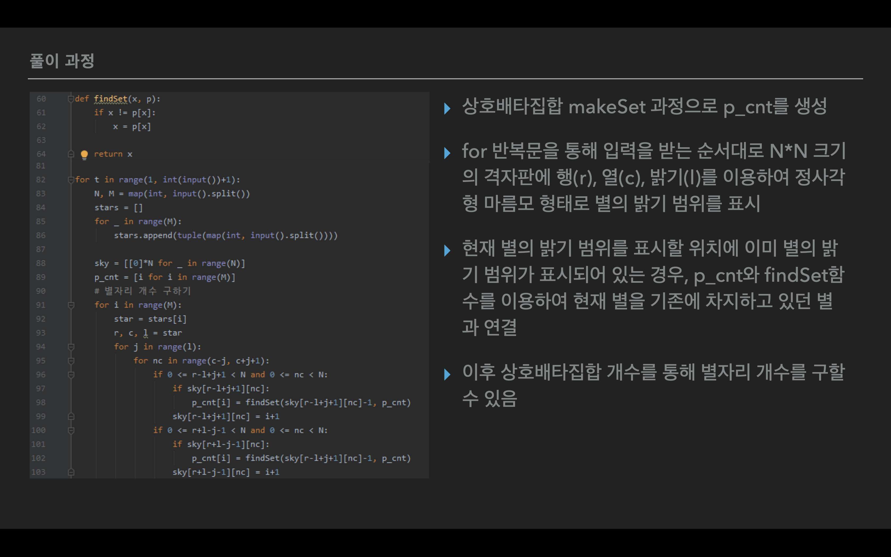
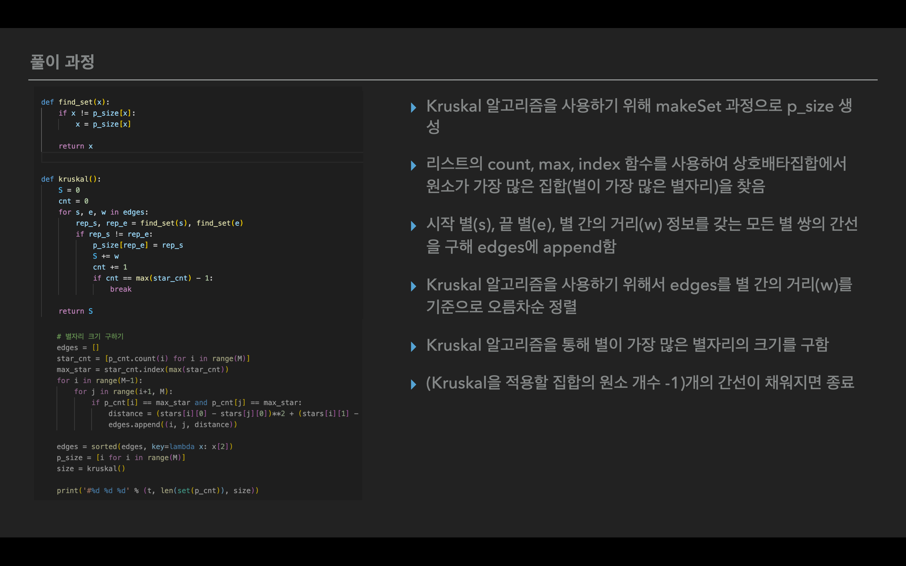
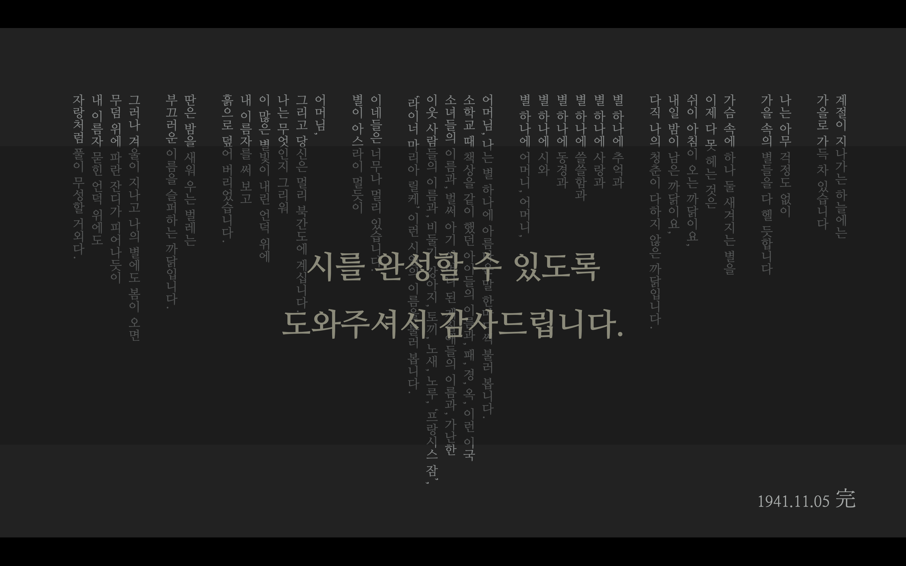

# 알고리즘 문제 출제

> 21.06.07 - 21.06.08 화
>
> 팀원 : 김현욱, 나승호, 송상민

해당 레포는 직접 출제한 알고리즘 문제를 담고 있습니다.

| 파일                                     | 내용                                                         |
| ---------------------------------------- | ------------------------------------------------------------ |
| [question.md](./question.md)             | '별 헤는 밤' 알고리즘의 문제를 확인할 수 있습니다.           |
| [sample_input.txt](./sample_input.txt)   | 알고리즘 문제를 풀이 시 사용할 수 있는 input을 확인할 수 있습니다. |
| [sample_output.txt](./sample_output.txt) | 알고리즘 문제를 풀이 시 사용할 수 있는 output을 확인할 수 있습니다. |
| [eval_input.txt](./eval_input.txt)       | 문제 풀이 평가 시 사용할 수 있는 50 개의 input을 확인할 수 있습니다. |
| [eval_output.txt](./eval_output.txt)     | 문제 풀이 평가 시 사용할 수 있는 50 개의 output을 확인할 수 있습니다. |
| [solution.py](./solution.py)             | '별 헤는 밤' 알고리즘의 문제 풀이 과정을 확인할 수 있습니다. |

---

