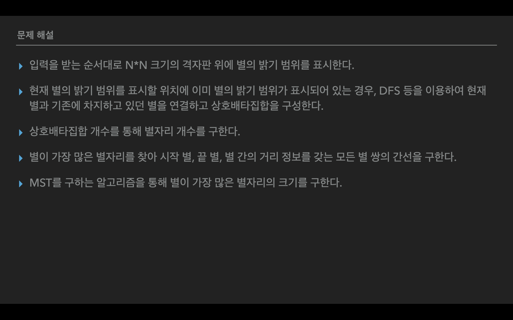

# 별 헤는 밤

## 🏆 알고리즘 문제 출제 대회

> 21.06.07 - 21.06.08 화
>
> 알고리즘 문제 출제 및 풀이, 테스트케이스 생성
>
> SSAFY 계절학기 알고리즘 문제 출제 대회 150개의 참여 팀 중 **TOP 5 선정**

| 파일                                     | 내용                                                   |
| ---------------------------------------- | ------------------------------------------------------ |
| [question.md](./question.md)             | '별 헤는 밤' 알고리즘 문제                             |
| [sample_input.txt](./sample_input.txt)   | 알고리즘 문제 풀이 시 활용 가능한 5개의 sample input   |
| [sample_output.txt](./sample_output.txt) | 알고리즘 문제 풀이 시 활용 가능한 5개의 sample ouput   |
| [eval_input.txt](./eval_input.txt)       | 문제 풀이 평가 시 활용 가능한 50개의 evaluation input  |
| [eval_output.txt](./eval_output.txt)     | 문제 풀이 평가 시 활용 가능한 50개의 evaluation output |
| [solution.py](./solution.py)             | '별 헤는 밤' 알고리즘 문제 풀이                        |

---

